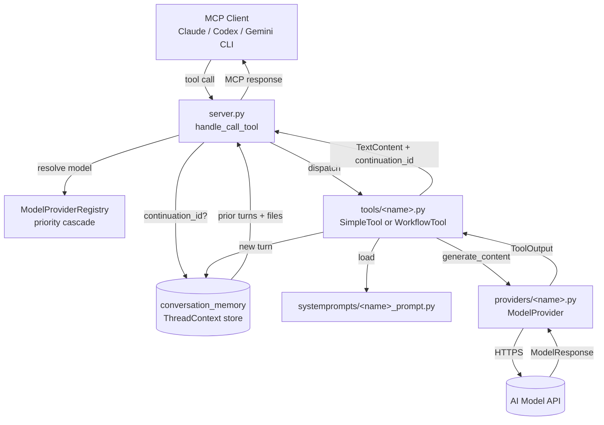

# Architecture Overview

This document is the 10-minute orientation for new contributors. It names the
major subsystems, draws the boundaries between them, and walks a request from
the MCP client to the model and back. Once you have read it, the task-specific
guides ([Adding Tools](adding_tools.md), [Adding Providers](adding_providers.md))
will make sense in context.

## The Big Picture

PAL MCP Server is a **stateless MCP server with a stateful conversation layer**.
The MCP protocol is request/response with no built-in memory, so PAL bridges
the gap by:

1. Exposing **tools** (chat, codereview, debug, planner, etc.) over the MCP
   wire protocol.
2. Routing each tool call to one or more **providers** (Gemini, OpenAI, Azure,
   X.AI, OpenRouter, DIAL, custom/Ollama) selected via a registry.
3. Pairing each tool with a dedicated **system prompt** that shapes the model's
   behaviour for that workflow.
4. Persisting **conversation threads** in process memory so consecutive tool
   calls can share context across tools and models.

The five subsystems below map almost 1:1 onto top-level directories.

```
server.py            ← MCP boundary: tool registry, request dispatch, error mapping
tools/               ← Tool implementations (Simple + Workflow architectures)
providers/           ← Model provider implementations + registry
systemprompts/       ← Per-tool system prompts
utils/conversation_memory.py  ← Thread lifecycle and context reconstruction
```

## Request Flow



## MCP Boundary (`server.py`)

`server.py` is the only file that talks the MCP wire protocol directly. It:

- **Builds the tool registry.** The `TOOLS` dict (around line 261) maps tool
  names to instantiated tool objects. `filter_disabled_tools()` removes any
  tool listed in the `DISABLED_TOOLS` env var, except `ESSENTIAL_TOOLS`
  (`version`, `listmodels`) which are always available.
- **Registers providers from env.** `configure_providers()` checks
  `GEMINI_API_KEY`, `OPENAI_API_KEY`, `AZURE_OPENAI_API_KEY`, `XAI_API_KEY`,
  `DIAL_API_KEY`, `OPENROUTER_API_KEY`, and `CUSTOM_API_URL`. Each present key
  registers the corresponding provider class with `ModelProviderRegistry`.
- **Handles `list_tools`** by iterating `TOOLS` and emitting `Tool` objects
  with the JSON Schema each tool advertises via `get_input_schema()`.
- **Handles `call_tool`** as the central dispatcher. For every call it:
  1. Calls `reconstruct_thread_context(arguments)` when `continuation_id` is
     present, hydrating prior conversation state from
     `utils/conversation_memory.py`.
  2. Resolves the model name (auto → category-preferred fallback, parses
     `model:option` like `o3:high` or `llama3.2:latest`).
  3. Looks up the provider via `ModelProviderRegistry.get_provider_for_model()`.
  4. Validates file sizes against the model's context window using
     `utils/file_utils.check_total_file_size()`.
  5. Builds a `ModelContext` and injects it as `arguments["_model_context"]`.
  6. Calls `tool.execute(arguments)`.
- **Translates errors** by wrapping failures in `ToolExecutionError`, whose
  payload is a serialized `ToolOutput` JSON object so the MCP client always
  receives structured `status`/`content`/`metadata` instead of a stack trace.
- **Serves prompts.** `handle_list_prompts` and `handle_get_prompt` surface the
  `PROMPT_TEMPLATES` dict so clients can offer canned slash-command-style
  launches per tool.

The MCP boundary owns model resolution and file-budget validation
deliberately — this keeps tools simple and ensures every call benefits from the
same checks regardless of architecture.

## Tools (`tools/`)

Tools are the unit of user-visible functionality. Each tool inherits from a
shared base class and contributes:

- A **`ToolRequest`** subclass (from `tools/shared/base_models.py`) — a Pydantic
  model that types and validates the JSON arguments coming in over MCP.
- A **system prompt import** from `systemprompts/` (see below).
- An **architecture choice**: `tools/simple/base.py::SimpleTool` for single
  request/response tools (`chat`, `apilookup`, `challenge`), or
  `tools/workflow/base.py::WorkflowTool` for multi-step investigations that
  accumulate findings between calls (`codereview`, `debug`, `consensus`,
  `planner`, `precommit`, `refactor`, etc.).

### The contract

The shared base (`tools/shared/base_tool.py`) marks these abstract:

- `get_name()`, `get_description()`, `get_system_prompt()`
- `get_input_schema()` (usually delegated to `SchemaBuilder` /
  `WorkflowSchemaBuilder`)
- `get_request_model()`
- `async prepare_prompt(request)`

The base classes handle conversation threading, file loading, token budgeting,
temperature constraints, retries, and response formatting. Tool subclasses
mostly compose Pydantic models and prompt-assembly functions.

### When validation happens

Validation is layered:

1. **MCP boundary** validates that the named tool exists and the model is
   available (`server.py::handle_call_tool`).
2. **Schema validation** runs when `tool.execute()` parses arguments into the
   `ToolRequest` subclass — invalid types or missing required fields raise
   `pydantic.ValidationError`, which is wrapped into a `ToolOutput` error.
3. **File-size validation** runs before tool dispatch (also at the boundary).
4. **Provider-level validation** (model name aliases, allowed-model lists)
   happens inside `ModelProvider.get_capabilities()`.

The output side flows through `ToolOutput` (defined in
`tools/shared/base_models.py`), which carries `status`, `content`,
`content_type`, and `metadata`. Every successful call returns a `ToolOutput`
serialized as `TextContent`; every failure raises `ToolExecutionError` with a
`ToolOutput` payload of `status="error"`.

## Providers (`providers/`)

A provider abstracts a model backend — an HTTP API plus its catalogue of
available models. The hierarchy:

- **`providers/base.py::ModelProvider`** is the abstract base. Subclasses must
  implement `get_provider_type()` and `generate_content()`; everything else
  (alias resolution, restriction checks, token counting) has sensible defaults.
- **`providers/openai_compatible.py::OpenAICompatibleProvider`** extends the
  base for any backend speaking the OpenAI chat-completions wire format. Most
  providers (`openai`, `xai`, `dial`, `custom`, `openrouter`) inherit from it
  and only customise base URL plus `MODEL_CAPABILITIES`.
- **`providers/azure_openai.py::AzureOpenAIProvider`** is the OpenAI-compatible
  flow plus a deployment map loaded from `conf/azure_models.json`.
- **`providers/gemini.py::GeminiModelProvider`** is a full `ModelProvider`
  using the Google Generative AI SDK directly.

### The registry

`providers/registry.py::ModelProviderRegistry` is a process-wide singleton
that:

- Maps `ProviderType` enum values to provider classes via
  `register_provider()`.
- Maintains `PROVIDER_PRIORITY_ORDER` (Google → OpenAI → Azure → X.AI → DIAL →
  Custom → OpenRouter). `get_provider_for_model(model_name)` walks this list
  and returns the first provider whose capabilities include the requested
  model.
- Owns `get_preferred_fallback_model(category)` — what `model="auto"` resolves
  to, per `ToolModelCategory` (`FAST_RESPONSE`, `EXTENDED_REASONING`, etc.).

### Configuration is env-driven

There is no static provider config file. `configure_providers()` in `server.py`
reads env vars at startup and calls `register_provider()` for each present
key. Provider-specific tunables (allowed models, base URLs, API versions,
Azure deployment maps) are also env-sourced and consumed when the registry
instantiates a provider. This is what lets the same Docker image flex between
"OpenAI only", "Ollama only", or "everything via OpenRouter" — drop the keys
into `.env`, restart.

## System Prompts (`systemprompts/`)

Each tool owns its prompt. The convention is one Python file per tool, named
`<tool>_prompt.py`, exporting a single uppercase constant
(`<TOOL>_PROMPT`) — for example `chat_prompt.py::CHAT_PROMPT`,
`codereview_prompt.py::CODEREVIEW_PROMPT`. The package `__init__.py`
re-exports every prompt so tools can write `from systemprompts import
CHAT_PROMPT`.

This pairing is intentional: the prompt is the tool's "personality" and lives
next to the tool's logic (one in `tools/`, one in `systemprompts/`). Adding a
tool always means adding both. The `clink` tool keeps its CLI-bridge prompts in
the `systemprompts/clink/` subdirectory instead of a single file, because each
linked CLI role (`planner`, `codereviewer`, etc.) gets its own prompt.

## Conversation Memory (`utils/conversation_memory.py`)

This module is the entire stateful layer of an otherwise stateless server.
It owns:

- **`ThreadContext`** and **`ConversationTurn`** Pydantic models that capture
  thread metadata (UUID, parent thread, tool name, timestamps) plus the
  ordered list of turns. Each turn records role, content, tool name, model
  provider, model name, and any referenced files or images.
- **Thread lifecycle**:
  - `create_thread(tool_name, initial_request, parent_thread_id=None)` mints
    a new UUID, filters non-serializable fields, and stores the empty thread.
  - `add_turn(thread_id, role, content, ...)` appends a turn; enforces the
    `MAX_CONVERSATION_TURNS` cap.
  - `get_thread(thread_id)` and `get_thread_chain(thread_id)` load a single
    thread or follow `parent_thread_id` links across linked threads.
- **Context reconstruction**: `build_conversation_history(context,
  model_context)` builds the prompt-ready conversation history string,
  applying the dual prioritization strategy (newest-first collection so token
  budgets evict the oldest turns / file references, then chronological
  presentation so the model reads turns oldest-to-newest).
- **Storage backend**: `utils/storage_backend.py` provides an in-memory store
  with a TTL (default 3 hours, configurable via `CONVERSATION_TIMEOUT_HOURS`).

`server.py::reconstruct_thread_context()` is the orchestrator that ties it
together: when an MCP call carries a `continuation_id`, it fetches the
thread, builds conversation history within the resolved model's token budget,
and injects the history into the tool's arguments before dispatch.

### Cross-tool continuation

A thread started by `analyze` can be continued by `debug` using the same
`continuation_id`. The second tool sees the first tool's prompts, responses,
and referenced files. This is what enables workflows like "review with
gemini-pro, plan with o3, implement with claude" — every model sees the
running transcript without the caller manually copying context.

## Where to add X?

| You want to add | Put it here | Then |
| --- | --- | --- |
| A new tool | `tools/<name>.py` | Register in `tools/__init__.py`, instantiate in `server.py::TOOLS`, optionally add to `PROMPT_TEMPLATES` |
| A new provider | `providers/<name>.py` | Add to `ProviderType` enum, register in `server.py::configure_providers()`, slot into `PROVIDER_PRIORITY_ORDER` |
| A new system prompt | `systemprompts/<tool>_prompt.py` | Export the constant from `systemprompts/__init__.py`, import it in the tool's `get_system_prompt()` |
| A shared utility | `utils/<name>.py` | Keep it pure when possible; the conversation memory module is the only utility with deep coupling to other subsystems |

The companion guides — [Adding Tools](adding_tools.md) and
[Adding Providers](adding_providers.md) — drill into each path with worked
examples.
